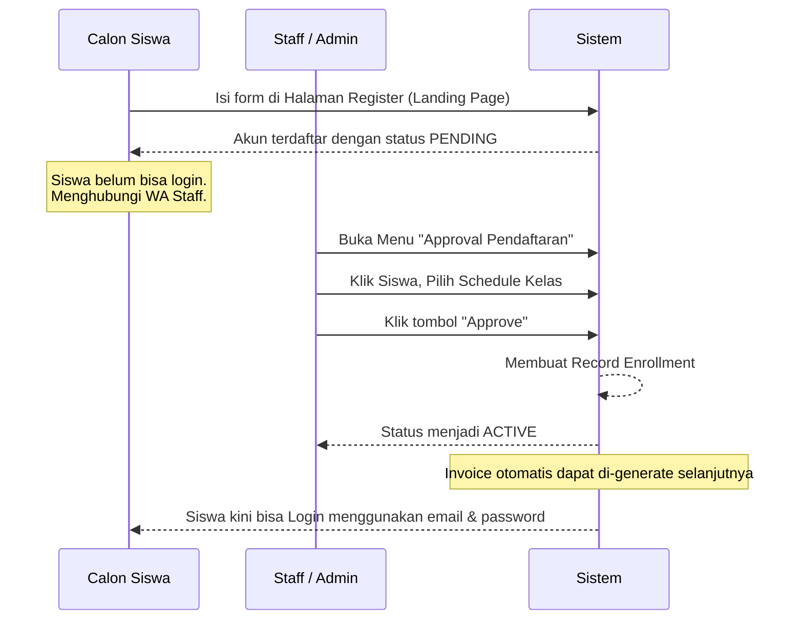

# User Flows (Alur Sistem Utama)

Berikut adalah diagram proses pendaftaran siswa yang benar sesuai implementasi sistem:

## 1. Alur Pendaftaran & Aktivasi Siswa (Registration Flow)

## 2. Alur Pencatatan Akademik (Guru)
- Guru login dan membuka menu **Jadwal Mengajar**.
- Guru memilih kelas spesifik (Masuk ke *Class Detail*).
- Guru membuat/membuka pertemuan (Masuk ke *Meeting Detail*).
- Guru mengisi **Jurnal Mengajar** dan mencentang status presensi anak.
- Data tersimpan dan bisa dilihat oleh murid dari menu **Progress Belajar**.
